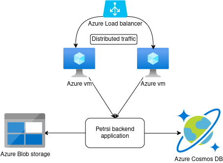

# CloudProject

In this project, we use Ansible to deploy a backend application for a pet management platform on two Azure virtual machines, with a load balancer in front of these machines.

## Architecture

The project architecture consists of:
- **Backend Application**: Deployed on two Azure VMs.
- **Load Balancer**: Distributes incoming traffic across the two VMs to ensure high availability and reliability.
- **Ansible**: Manages the deployment and configuration of the infrastructure and application.



## Infrastructure as Code (IaC) and Configuration as Code (CaC)

### Infrastructure as Code (IaC)
This project leverages Ansible to implement Infrastructure as Code (IaC), which automates the provisioning and management of the cloud infrastructure. By defining the infrastructure (such as Azure VMs and load balancers) in code, we ensure consistency and scalability in deployments. The infrastructure can be easily recreated or modified by running the Ansible playbooks.

### Configuration as Code (CaC)
Configuration as Code (CaC) is also achieved through Ansible, where the configurations of the application and environment are defined in YAML files. Ansible applies these configurations consistently across all servers, eliminating configuration drift and ensuring that the environment matches the desired state every time it's deployed.

## Prerequisites

Before you begin, ensure you have met the following requirements:
- **Azure Account**: You need an active Azure account to create virtual machines.
- **Ansible Installed**: Make sure Ansible is installed on your local machine or control node.
- **Docker**: The application is containerized using Docker, so Docker should be installed on the target machines.
- **Node.js and NPM**: Required for running the backend application.
- **Git**: For cloning the repository.

## Installation and Running the Project

Follow these steps to deploy and run the project:

1. **Clone the Repository**:
    ```bash
    git clone https://github.com/souheilbenslama/CloudProject.git
    cd CloudProject
    ```

2. **Configure Azure Resources**:
   - Create two virtual machines on Azure.
   - Set up a load balancer that routes traffic to these VMs.

3. **Update Ansible Inventory**:
   - Edit the `inventory` file to include the IP addresses of the Azure VMs.

4. **Run Ansible Playbook**:
   - Execute the following command to deploy the application:
    ```bash
    ansible-playbook playbook.yaml -i inventory
    ```

5. **Access the Application**:
   - Once the playbook completes, the application should be accessible through the public IP of the load balancer.

## License

This project is open-source and available under the [MIT License](LICENSE).
